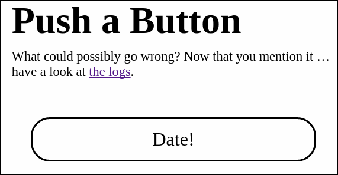
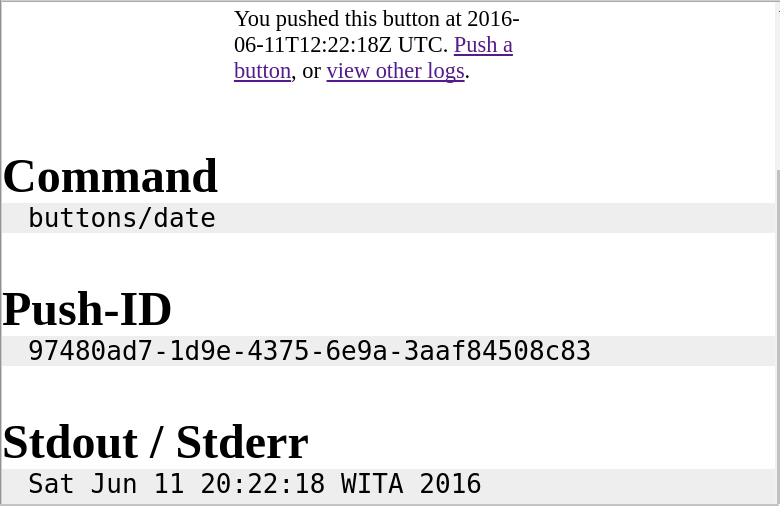
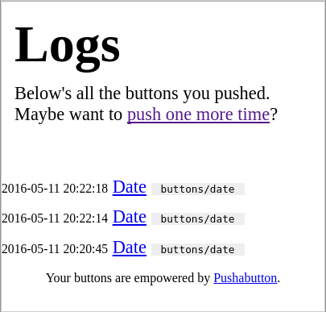

# Pushabutton
Minimal web app to run scripts.

Put anything executable in the `buttons` dir.
It'll show up as a button in the web UI.
Then, you can push a button.

For example,

    buttons$ ln -s $(which date)

Looking at the web-UI, you immediately get a button that you can click.

After clicking, the executable is run and you get a log:

Remember what command you ran yesterday? No worries, `Pushabutton` remembers.

## Simple Parameters

Oh, and then there's parameters! Let's say you're interested in running the `id` command from the web, to find the IDs of users:

    $ ln -s $(which id)

Now, you need to pass a username. Add a textfile `id.parameters`:

    $ cat id.parameters
    username

When clicking the button, you'll get a modal asking for the username:

## More features

* Add descriptions to parameters
* Make the user choose a value for a parameter with a drop-down list.
* Determine the valid choice at runtime (by running a script).

How to configure these, see the examples after running setup.

## Setup & Running

Run the setup command:

  $ ./pushabutton setup

This will setup the necessary directories and some demo scripts:

    $ tree
    .
    ├── buttons
    │   ├── what_is_the_current_date.sh
    │   ├── write-message-to-logged-in-user.sh
    │   ├── write-message-to-logged-in-user.sh.parameters
    │   └── write-message-to-logged-in-user.sh.parameters.user-tty.choices.sh
    ├── logs
    └── pushabutton

Run the server:

   $ ./pushabutton serve
   Running server on :8080

# License

MIT, see [LICENSE](./LICENSE) file

# Dependencies, their license & thanks!

We're using the following libraries directly:

[gouuid](https://github.com/nu7hatch/gouuid) and [kingpin.v2](gopkg.in/alecthomas/kingpin.v2)

Thru the vendor directory, we're redistributing source code of the following projects:

    $ govend -tv

* [github.com/nu7hatch/gouuid](https://github.com/nu7hatch/gouuid) MIT
* [gopkg.in/alecthomas/kingpin.v2](gopkg.in/alecthomas/kingpin.v2) MIT
  * [github.com/alecthomas/units](https://github.com/alecthomas/units) MIT
    * [github.com/stretchr/testify/assert](https://github.com/stretchr/testify) MIT
      * [github.com/pmezard/go-difflib/difflib](https://github.com/pmezard/go-difflib) MIT
      * [github.com/davecgh/go-spew/spew](https://github.com/davecgh/go-spew) ISC
        * [github.com/davecgh/go-spew/spew/testdata](https://github.com/davecgh/go-spew) ISC
  * [github.com/alecthomas/template](https://github.com/alecthomas/template) GO license
    * [github.com/alecthomas/template/parse](https://github.com/alecthomas/template) GO license
  * [github.com/alecthomas/assert](https://github.com/alecthomas/assert) MIT
    * [github.com/sergi/go-diff/diffmatchpatch](https://github.com/sergi/go-diff) MIT
      * [github.com/stretchrcom/testify/assert](https://github.com/stretchrcom/testify) MIT
    * [github.com/alecthomas/repr](https://github.com/alecthomas/repr) MIT
    * [github.com/alecthomas/colour](https://github.com/alecthomas/colour) MIT
      * [github.com/mattn/go-isatty](https://github.com/mattn/go-isatty) MIT
        * [golang.org/x/sys/unix](https://godoc.org/golang.org/x/sys/unix) Go license
